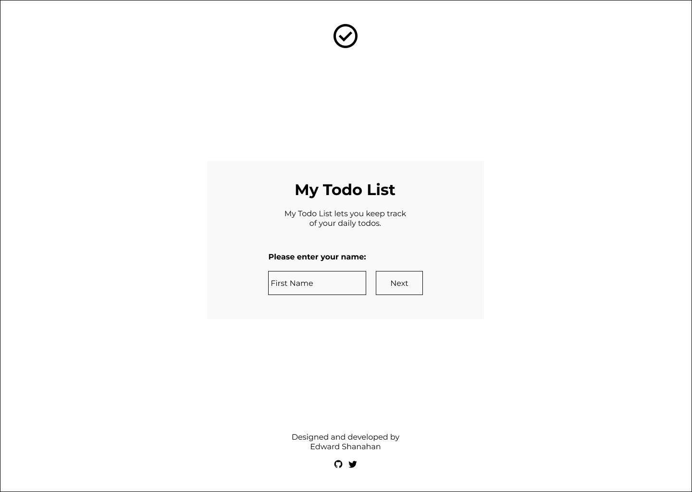

# My Todo List

# Contents 
- [User Experience](#user-experience)
  - [User Stories](#user-stories)
    - [User](#user)
    - [Site Owner](#site-owner)
- [Design](#design)
  - [Wireframes](#wireframes)
- [Features](#features)
  - [Existing Features](#existing-features)
  - [Future  Features](#future-features)
- [Testing](#testing)
  - [Validator Testing](#validator-testing)
  - [Unfixed Bugs](#unfixed-bugs)
- [Deployment](#deployment)
- [Credits](#credits)
  - [Content](#content)
  - [Media](#media)

## User Experience 

### User Stories 

#### User
- As a user, I want to create new todos.
- As a user, I want to check off my completed todos.
- As a user, I want to delete unwanted todos.
- As a user, I want to delete all todos.
- As a user, I want the website to save my todos when I leave the page.

#### Site Owner
- As a site owner, I want my website to be responsive on all devices.
- As a site owner, I want my website to be user-friendly.
- As a site owner, I want my website to be user-friendly.

## Design 

### Wireframes

Wireframes were created using [Figma](https://www.figma.com/)

Desktop Wireframe - Profile Section

Desktop Wireframe - Todo Section

Mobile Wireframe - Profile Section

Mobile Wireframe - Todo Section

### Typeography

Font used: [Montserrat](https://fonts.google.com/specimen/Montserrat)

Font Weight:
- 400
- 700

### Colours

### Prototype 

## Features

### Existing Features

### Future Features

## Testing 

### Validator Testing

### Unfixed Bugs

## Deployment 

## Credits

### Content

### Media
