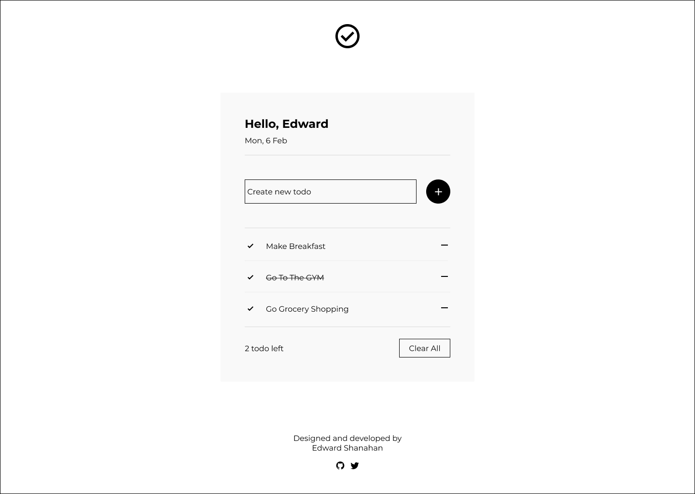

# My Todo List

# Contents 
- [User Experience](#user-experience)
  - [User Stories](#user-stories)
    - [User](#user)
    - [Site Owner](#site-owner)
- [Design](#design)
  - [Wireframes](#wireframes)
- [Features](#features)
  - [Existing Features](#existing-features)
  - [Future  Features](#future-features)
- [Testing](#testing)
  - [Validator Testing](#validator-testing)
  - [Unfixed Bugs](#unfixed-bugs)
- [Deployment](#deployment)
- [Credits](#credits)
  - [Content](#content)
  - [Media](#media)

## User Experience 

### Projext Objective 
My Todo List aims to create a user-friendly application. The goal of this project is to help users keep track of their daily to-dos. Users can create new to-dos and check them off as they go along. They can also delete unwanted or completed todos. If the user leaves or refreshes the page their progress will remain the same.

### User Stories 

#### User
- As a user, I want to create new todos.
- As a user, I want to check off my completed todos.
- As a user, I want to delete unwanted todos.
- As a user, I want to delete all todos.
- As a user, I want the website to save my todos when I leave the page.

#### Site Owner
- As a site owner, I want my website to be responsive on all devices.
- As a site owner, I want my website to be user-friendly.
- As a site owner, I want my website to be user-friendly.

## Design 

### Wireframes

Wireframes were created using [Figma](https://www.figma.com/)

Desktop Wireframe - Profile Section

Desktop Wireframe - Todo Section

Mobile Wireframe - Profile Section

Mobile Wireframe - Todo Section

### Typeography

Font used: [Montserrat](https://fonts.google.com/specimen/Montserrat)

Font Weight:
- 400
- 700

### Colours

### Prototype 

## Features

### Existing Features

### Future Features

## Testing 

### Validator Testing

- HTML
  - HTML was validated with [W3C Validation Markup](https://validator.w3.org/).
  - No errors were returned

Result

- CSS
  - CSS was validated with [jigsaw](https://jigsaw.w3.org/css-validator/#validate_by_input).
  - No errors were returned

Result

- JavaScript
  - JavaScript was validated with [jshint](https://jshint.com/).
  - 15 warnings were returned, "missing semicolons". Fixed the error by adding the semicolons.
  - No new error were return.
  

Result

No known bugs

### Lighthouse 

#### Desktop Results

Result

#### Desktop Results

Result

## Deployment 
This site is deployed to GitHub Pages, using these steps:

1. Log in to GitHub and go to project [repository](https://github.com/EdwardShanahan07/my-todo-list)
2. Naviagte to the settings tab
3. On the left side of the page, navigate to Pages
4. From the source drop down menu named "none", seletect Main Branch
5. The page will automatically refresh, a live link to the deployed site should displayed

The live link can be found here [https://edwardshanahan07.github.io/my-todo-list/](https://edwardshanahan07.github.io/my-todo-list/)

## Credits

### Content

- Get the current date and return the valie: [MDN](https://developer.mozilla.org/en-US/docs/Web/JavaScript/Reference/Global_Objects/Date/toLocaleDateString)
- Save the username and todos to local storage and looping through the todos array to create list item element. [Tyler Potts](https://www.youtube.com/watch?v=6eFwtaZf6zc&t=2529s)
- Filter how many todos are left to be completed: [Stack Overflow](https://stackoverflow.com/questions/57173027/filtered-array-length)

### Media

- Favicon convert: [Favicon.io](https://favicon.io/favicon-converter/)
- Font Family from Google Fonts: [Montserrat](https://fonts.google.com/specimen/Montserrat)
- Icons used are from [Font Awesome](https://fontawesome.com/)
- Wireframe Created with [Figma](https://www.figma.com/)
- Colours used in this projeck are from [Coolors](https://coolors.co/)
